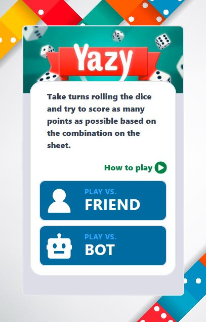

# YAZY - A 5 die game

Welcome! 👋
Thanks for checking out my front-end project.

To do this project I used :

HTML,
CSS and
JavaScript.
Play Rock, Paper, Scissors, Lizard, Spock against the computer Click Here

Points
If the player wins, they gain 1 point. If the computer wins, the player loses one point.

Rules
Scissors beats Paper
Paper beats Rock
Rock beats Lizard
Lizard beats Spock
Spock beats Scissors
Scissors beats Lizard
Paper beats Spock
Rock beats Scissors
Lizard beats Paper
Spock beats Rock
Not sure what Rock, Paper, Scissors, Lizard, Spock is? Check out this clip from The Big Bang Theory.

How to play ?
Select one amongst the five possible options.
The computer also selects one randomly.
Based on the rules (listed above) the winner is decided.
The points are added or subtracted from the total.
At start 10 points are given to each player.
Something happens when your score goes below 0, check it out
