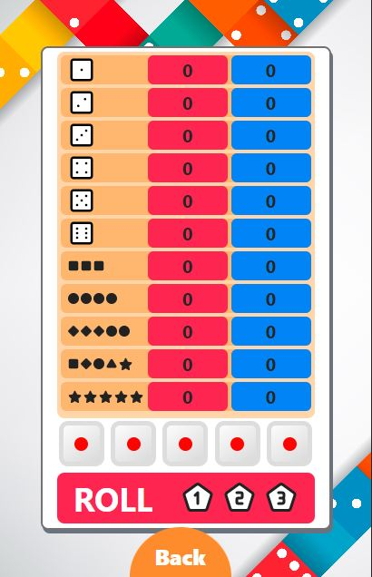

# YAZY - A 5 die game

### Welcome! 👋

Thanks for checking out my front-end project.

**To do this project I used :**

- HTML,
- CSS
- JavaScript
- React
- Tailwind

**Play 2 Player YAZY game now.** [Click Here](https://yazygame.netlify.app/)

## Points

Points are given to each player based on the numbers on the 5 die. The total is then calculated after all turns are over. The player with most points wins the game!!

## Rules

There are 11 blocks to fill with points with each block having its own requirements(listed below):

- Count and add only aces
- Count and add only twos
- Count and add only threes
- Count and add only fours
- Count and add only fives
- Count and add only sixes
- If 3 of a kind then add all
- If 4 of a kind then add all
- If 3 of one kind and 2 of another, Score: 25.
- Sequence of 5, Score: 40.
- 5 of a kind, Score: 50.

Not sure how to play is? Check this out [click here](https://walnutstudiolo.com/blogs/blog/how-to-play-dice-yacht-yatzy-game-rules-of-play).

## How to play ?

- The game consists of 11 rounds, and both player one turn within each round. Each turn consists of up to 5 rolls of the dice. The object of a turn is to designate dice to count in one of the 11 categories shown above.
- At the beginning of each turn, the player throws all 5 dice. The player selects any of the dice they wish to designate to a scoring category, and rolls the rest of the dice again. Same with the second roll. The player may "stay" at any time and is not required to roll all 3 times. After the third roll or "stay", the player must select a block to enter the score (which may be zero) under their own column.
- No block can be used more than once in the course of the game.
- When both player has had 11 turns, the scores on the blocks are added and the highest score wins.

## Issues

- The blocks can be selected even without first roll and the value is selected based on the previous roll. If you could fix the issue please contribute to it. I am unable to remove event listener function from the block which causes this issue.

- The _how to play_ and **Player vs Bot** functionality isn't added yet.

- The code is a bit messy(due to trial and error) and can be optimised and cleaned.

## Me

Hey there! My name is Mohd Saad. I am an aspiring Web Developer and currently a Btech student. If you like this project then you can star this repo and if you want to work in a team on any project, contact me via mail or on my [LinkedIn](https://www.linkedin.com/in/webdevmsaad/) profile.
